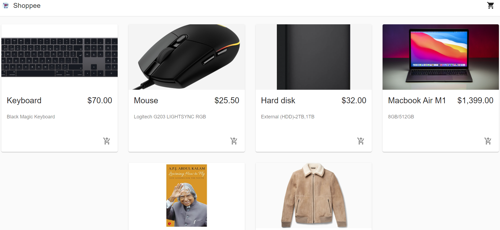
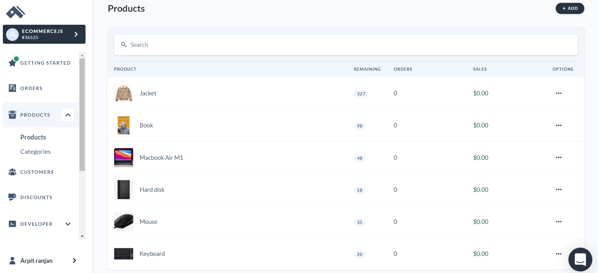
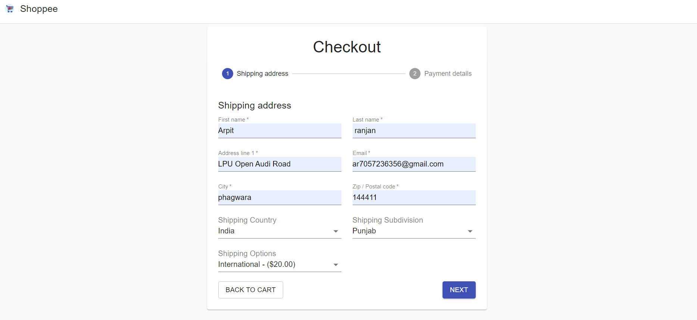
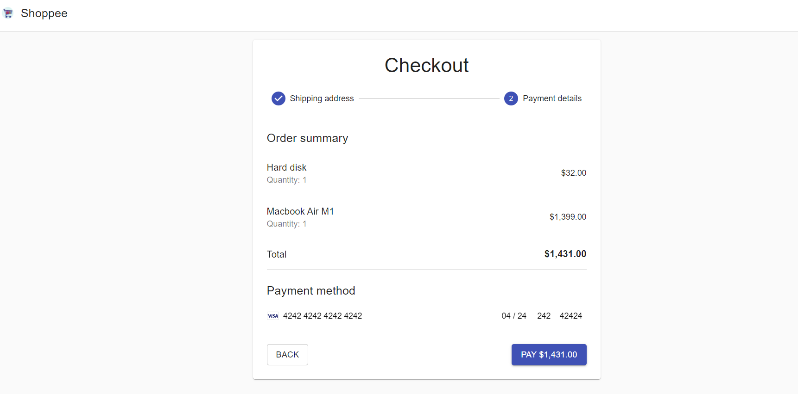

# E-Commerce
To Run this Project 
## npm start

This is a ecommerce website, in which we can shop product and the product will be shiped to billed address.
Admin can Add new product through commerce.js  
##
In this project I used commerce.js for backend to store product details

##
For payment Gatway I used striped in developer modes 

